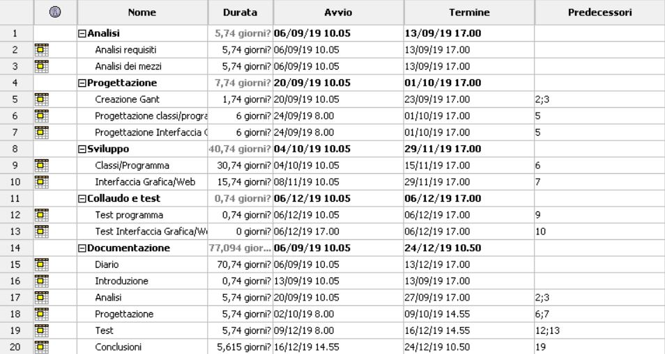
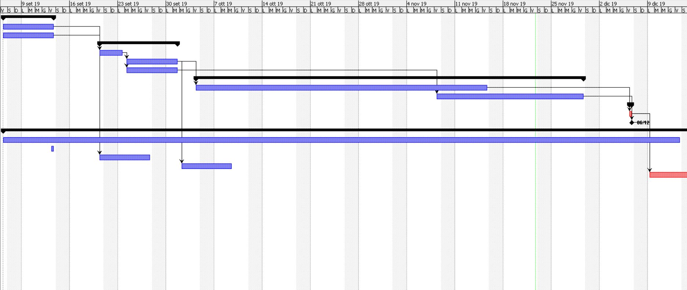
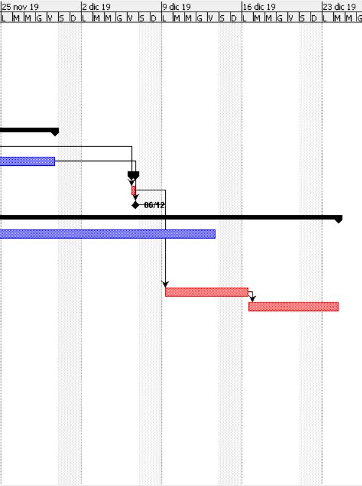

1. [Introduzione](#introduzione)

  - [Informazioni sul progetto](#informazioni-sul-progetto)

  - [Abstract](#abstract)

  - [Scopo](#scopo)

1. [Analisi](#analisi)

  - [Analisi del dominio](#analisi-del-dominio)

  - [Analisi dei mezzi](#analisi-dei-mezzi)

  - [Analisi e specifica dei requisiti](#analisi-e-specifica-dei-requisiti)

  - [Use case](#use-case)

  - [Pianificazione](#pianificazione)

1. [Progettazione](#progettazione)

  - [Design dell’architettura del sistema](#design-dell’architettura-del-sistema)

  - [Design dei dati e database](#design-dei-dati-e-database)

1. [Implementazione](#implementazione)

1. [Test](#test)

  - [Protocollo di test](#protocollo-di-test)

  - [Risultati test](#risultati-test)

  - [Mancanze/limitazioni conosciute](#mancanze/limitazioni-conosciute)

1. [Consuntivo](#consuntivo)

1. [Conclusioni](#conclusioni)

  - [Sviluppi futuri](#sviluppi-futuri)

  - [Considerazioni personali](#considerazioni-personali)

1. [Sitografia](#sitografia)

1. [Allegati](#allegati)

## Introduzione

### Informazioni sul progetto

  - Questo progetto sarà realizzato dall'allievo:  
        Marco Lorusso
     Mentre i docenti che avranno il ruolo di clienti/capo azienda sono:  
        Luca Muggiasca,
        Geo Petrini
  - Scuola d'arti e mestieri Trevano, Informatica, modulo 306

  -   Il progetto è stato iniziato il  03.09.2019 e finirà il 20.12.2019

### Abstract

  Il documento seguente conterrà tutto ciò che riguarda il progetto fiocco di neve,
  dall'Analisi, alla progettazione, all'implementazione, ai test e alle conclusioni.
  Il progetto è stato creato a scopi didattici, è stato eseguito in java, e tratta
  di fare un programma dove con un triangolo, l'utente inserisce dei punti nel frame che compare, li potrà salvare e caricare, spostare e eliminare, una volta finito, tramite il bottone 'genera' si creerà un fiocco di neve, e infine con il bottone 'salva' si potrà scaricare il .jar dell'applicativo.

### Scopo

  Lo scopo di questo progetto è completamente didattico, mi aiuterà a entrare nel
  mondo dei progetti singoli, e mi metterà alla prova con il linguaggio di programmazione
  java.  
  Il progetto consiste nel fare un'applicativo con java, che permette di creare
  un fiocco di neve. Partendo da un triangolo pieno e con dei punti taglio fatti
  col mouse, si tolgono alcune parti del triangolo e inseguito verrà generato
  il fiocco di neve.

## Analisi

### Analisi del dominio

  Il contesto del prodotto, è completamente scolastico, il progetto è creato da
  una specifica consegnata dai professori, con lo scopo di imparare a fare dei
  progetti e a migliorare la conoscenza con il linguaggio di programmazione java.

  Oltre a scopo didattico, non ci trovo un vero contesto dove usarlo.

  Per adoperare con il codice del programma bisogna sapere almeno un minimo di java.

### Analisi e specifica dei requisiti

  |**ID**|**Nome**			|**Priorità**|**Vers**|**Note** |
  |------|-------------|------------|--------|---------|
  |Req-01|L'applicativo deve essere scritto in java.|1|1.0|...|
  |Req-02|Bisogna creare un sito con descrizione software.|1|1.0|...|
  |Req-03|Deve essere possibile scaricare il software|1|1.0|...|
  |Req-04|I tagli nel triangolo devono poter essere fatti con il mouse.|1|1.0|...|
  |Req-05|Deve essere possibile resettare i punti registrati.|1|1.0|...|
  |Req-06|Si possono rimuovere o spostare i punti.|2|1.0|...|
  |Req-07|Ci deve essere un tasto genera, che crea il fiocco di neve e visualizza l'anteprima.|1|1.0|...|
  |Req-08|La generazione del fiocco di neve finale può avvenire in tempo reale.|2|1.0|...|
  |Req-09|Si deve poter salvare il fiocco di neve.|1|1.0|...|
  |Req-10|Si devono poter salvare i punti di taglio del fiocco per permettere modifiche o rigenerazioni future.|1|1.0|...|
  |Req-11|Il salvataggio del lavoro deve essere fatto in formato PNG o SVG.|1|1.0|...|
  |Req-12|Il salvataggio deve avere dimensioni definite dall'utente.|1|1.0|...|
  |Req-11|Deve esserci un'interfaccia grafica.|1|1.0|...|
  |Req-12|L'area di lavoro deve essere un triangolo.|1|1.0|...|
  |Req-13|La finestra deve essere ridimensionabile e sarà di minio 1024x768.|1|1.0|...|
  |Req-14|Nel sito ci deve essere la lista dei requisiti, JRE, guida con screenshots.|1|1.0|...|
  |Req-15|Il salvataggio in vettoriale, dev'essere della dimensione corrente, di 500 o di 1000.|1|1.0|...|
  |Req-16|Per il salvataggio l'utente deve vedere una schermata per scegliere il formato.|1|1.0|...|

**Spiegazione elementi tabella dei requisiti:**

**ID**: identificativo univoco del requisito

**Nome**: breve descrizione del requisito

**Priorità**: indica l’importanza di un requisito nell’insieme del
progetto, definita assieme al committente. Ad esempio poter disporre di
report con colonne di colori diversi ha priorità minore rispetto al
fatto di avere un database con gli elementi al suo interno. Solitamente
si definiscono al massimo di 2-3 livelli di priorità.

**Versione**: indica la versione del requisito. Ogni modifica del
requisito avrà una versione aggiornata.

Sulla documentazione apparirà solamente l’ultima versione, mentre le
vecchie dovranno essere inserite nei diari.

**Note**: eventuali osservazioni importanti o riferimenti ad altri
requisiti.

**Sotto requisiti**: elementi che compongono il requisito.

### Use case

Questo programma è stato creato a scopo didattico, dunque non ha scopi di utilizzo,
tranne se viene ottimizzato, potrebbe diventare un gioco dove, con la creazione
del fiocco di neve si procede per un perscorso, dove bisogna fare vari obbiettivi.

### Pianificazione

  

  

### Analisi dei mezzi

Questo programma verrà creato con il linguaggio di programmazione java, la Versione che uso è la 12.0.2, mentre come compilatore/editore, uso netBeans versione 11.1.
Non richiede nessun hardware particolare per eseguire/creare questo programma.

SDK, librerie, tools utilizzati per la realizzazione del progetto e
eventuali dipendenze.

## Progettazione

### Design dell’architettura del sistema

### Design delle interfacce

   

### Design procedurale

Descrive i concetti dettagliati dell’architettura/sviluppo utilizzando
ad esempio:

-   Diagrammi di flusso e Nassi.

-   Tabelle.

-   Classi e metodi.

Questi documenti permetteranno di rappresentare i dettagli procedurali
per la realizzazione del prodotto.

## Implementazione

In questo capitolo dovrà essere mostrato come è stato realizzato il
lavoro. Questa parte può differenziarsi dalla progettazione in quanto il
risultato ottenuto non per forza può essere come era stato progettato.

Sulla base di queste informazioni il lavoro svolto dovrà essere
riproducibile.

In questa parte è richiesto l’inserimento di codice sorgente/print
screen di maschere solamente per quei passaggi particolarmente
significativi e/o critici.

Inoltre dovranno essere descritte eventuali varianti di soluzione o
scelte di prodotti con motivazione delle scelte.

Non deve apparire nessuna forma di guida d’uso di librerie o di
componenti utilizzati. Eventualmente questa va allegata.

Per eventuali dettagli si possono inserire riferimenti ai diari.

## Test

### Protocollo di test

Definire in modo accurato tutti i test che devono essere realizzati per
garantire l’adempimento delle richieste formulate nei requisiti. I test
fungono da garanzia di qualità del prodotto. Ogni test deve essere
ripetibile alle stesse condizioni.

|Test Case      | TC-001                               |
|---------------|--------------------------------------|
|**Nome**       |Import a card, but not shown with the GUI |
|**Riferimento**|REQ-012                               |
|**Descrizione**|Import a card with KIC, KID and KIK keys with no obfuscation, but not shown with the GUI |
|**Prerequisiti**|Store on local PC: Profile\_1.2.001.xml (appendix n\_n) and Cards\_1.2.001.txt (appendix n\_n) |
|**Procedura**     | - Go to “Cards manager” menu, in main page click “Import Profiles” link, Select the “1.2.001.xml” file, Import the Profile - Go to “Cards manager” menu, in main page click “Import Cards” link, Select the “1.2.001.txt” file, Delete the cards, Select the “1.2.001.txt” file, Import the cards |
|**Risultati attesi** |Keys visible in the DB (OtaCardKey) but not visible in the GUI (Card details) |

### Risultati test

Tabella riassuntiva in cui si inseriscono i test riusciti e non del
prodotto finale. Se un test non riesce e viene corretto l’errore, questo
dovrà risultare nel documento finale come riuscito (la procedura della
correzione apparirà nel diario), altrimenti dovrà essere descritto
l’errore con eventuali ipotesi di correzione.

### Mancanze/limitazioni conosciute

Descrizione con motivazione di eventuali elementi mancanti o non
completamente implementati, al di fuori dei test case. Non devono essere
riportati gli errori e i problemi riscontrati e poi risolti durante il
progetto.

## Consuntivo

Consuntivo del tempo di lavoro effettivo e considerazioni riguardo le
differenze rispetto alla pianificazione (cap 1.7) (ad esempio Gannt
consuntivo).

## Conclusioni

Quali sono le implicazioni della mia soluzione? Che impatto avrà?
Cambierà il mondo? È un successo importante? È solo un’aggiunta
marginale o è semplicemente servita per scoprire che questo percorso è
stato una perdita di tempo? I risultati ottenuti sono generali,
facilmente generalizzabili o sono specifici di un caso particolare? ecc

### Sviluppi futuri
  Migliorie o estensioni che possono essere sviluppate sul prodotto.

### Considerazioni personali
  Cosa ho imparato in questo progetto? ecc

## Bibliografia

### Bibliografia per articoli di riviste
1.  Cognome e nome (o iniziali) dell’autore o degli autori, o nome
    dell’organizzazione,

2.  Titolo dell’articolo (tra virgolette),

3.  Titolo della rivista (in italico),

4.  Anno e numero

5.  Pagina iniziale dell’articolo,

### Bibliografia per libri

1.  Cognome e nome (o iniziali) dell’autore o degli autori, o nome
    dell’organizzazione,

2.  Titolo del libro (in italico),

3.  ev. Numero di edizione,

4.  Nome dell’editore,

5.  Anno di pubblicazione,

6.  ISBN.

### Sitografia

1.  URL del sito (se troppo lungo solo dominio, evt completo nel
    diario),

2.  Eventuale titolo della pagina (in italico),

3.  Data di consultazione (GG-MM-AAAA).

**Esempio:**

-   http://standards.ieee.org/guides/style/section7.html, *IEEE
    Standards Style Manual*, 07-06-2008.

## Allegati

Elenco degli allegati, esempio:

-   Diari di lavoro

-   Codici sorgente/documentazione macchine virtuali

-   Istruzioni di installazione del prodotto (con credenziali
    di accesso) e/o di eventuali prodotti terzi

-   Documentazione di prodotti di terzi

-   Eventuali guide utente / Manuali di utilizzo

-   Mandato e/o Qdc

-   Prodotto

-   …
