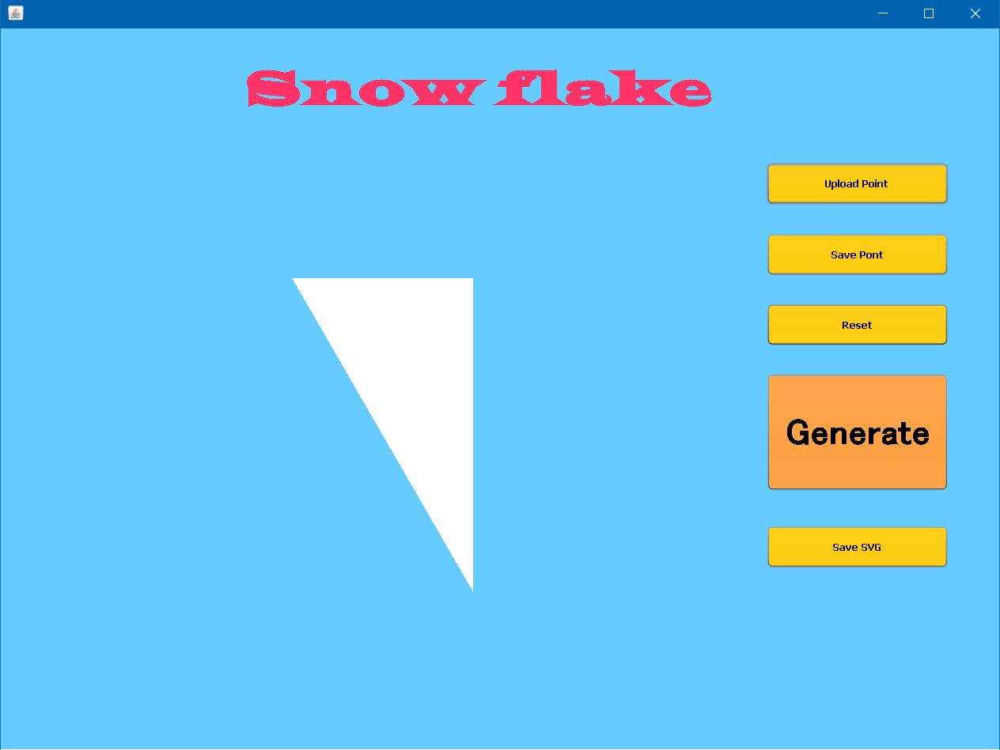

21. [Introduzione](#introduzione)

  - [Informazioni sul progetto](#informazioni-sul-progetto)

  - [Abstract](#abstract)

  - [Scopo](#scopo)

1. [Analisi](#analisi)

  - [Analisi del dominio](#analisi-del-dominio)

  - [Analisi dei mezzi](#analisi-dei-mezzi)

  - [Analisi e specifica dei requisiti](#analisi-e-specifica-dei-requisiti)

  - [Use case](#use-case)

  - [Pianificazione](#pianificazione)

1. [Progettazione](#progettazione)

  - [Design dell’architettura del sistema](#design-dell’architettura-del-sistema)

  - [Design dei dati e database](#design-dei-dati-e-database)

1. [Implementazione](#implementazione)

1. [Test](#test)

  - [Protocollo di test](#protocollo-di-test)

  - [Risultati test](#risultati-test)

  - [Mancanze/limitazioni conosciute](#mancanze/limitazioni-conosciute)

1. [Consuntivo](#consuntivo)

1. [Conclusioni](#conclusioni)

  - [Sviluppi futuri](#sviluppi-futuri)

  - [Considerazioni personali](#considerazioni-personali)

1. [Sitografia](#sitografia)

1. [Allegati](#allegati)

## Introduzione

### Informazioni sul progetto

  - Questo progetto è stato realizzato dall'allievo:  
        - Marco Lorusso
     Mentre i docenti che avranno il ruolo di clienti/capo azienda sono:  
        - Luca Muggiasca,  
        - Geo Petrini
  - Scuola d'arti e mestieri Trevano, Informatica, modulo 306

  -   Il progetto è stato iniziato il  03.09.2019 e finirà il 20.12.2019

### Abstract

  This documet will contain everything about the "Snow flake" project, from analysis, design, implementation, testing and conclusions. The project was created completly for education.
  It consists of making making a program, where with a basic triangle, the user insert points in the frame, you can too save and upload points from a file, move and delete.
  Once finished, using the button "generate" will generate a snowflake.
  Finally, with a special button in the website you can download the .jar of the application.

### Scopo

  Lo scopo di questo progetto è completamente didattico, mi aiuterà a entrare nel
  mondo dei progetti singoli, e mi metterà alla prova con il linguaggio di programmazione java.  
  Il progetto consiste nel fare un'applicativo con java, che permette di creare
  un fiocco di neve. Partendo da un triangolo pieno e con dei punti taglio fatti
  col mouse, si tolgono alcune parti del triangolo e inseguito verrà generato
  il fiocco di neve.

## Analisi

### Analisi del dominio

  Il contesto del prodotto, è completamente scolastico, il progetto è creato da
  una specifica consegnata dai professori, con lo scopo di imparare a fare dei
  progetti e a migliorare la conoscenza con il linguaggio di programmazione java.

  Oltre a scopo didattico, non ci trovo un vero contesto dove usarlo.

  Per adoperare con il codice del programma bisogna sapere almeno un minimo di java.

### Analisi e specifica dei requisiti

  |**ID**|**Nome**			|**Priorità**|**Vers**|**Note** |
  |------|-------------|------------|--------|---------|
  |Req-01|L'applicativo deve essere scritto in java.|1|1.0|...|
  |Req-02|Bisogna creare un sito con descrizione software.|1|1.0|...|
  |Req-03|Deve essere possibile scaricare il software|1|1.0|...|
  |Req-04|I tagli nel triangolo devono poter essere fatti con il mouse.|1|1.0|...|
  |Req-05|Deve essere possibile resettare i punti registrati.|1|1.0|...|
  |Req-06|Si possono rimuovere o spostare i punti.|2|1.0|...|
  |Req-07|Ci deve essere un tasto genera, che crea il fiocco di neve e visualizza l'anteprima.|1|1.0|...|
  |Req-08|La generazione del fiocco di neve finale può avvenire in tempo reale.|2|1.0|...|
  |Req-09|Si deve poter salvare il fiocco di neve.|1|1.0|...|
  |Req-10|Si devono poter salvare i punti di taglio del fiocco per permettere modifiche o rigenerazioni future.|1|1.0|...|
  |Req-11|Il salvataggio del lavoro deve essere fatto in formato PNG o SVG.|1|1.0|...|
  |Req-12|Il salvataggio deve avere dimensioni definite dall'utente.|1|1.0|...|
  |Req-13|Deve esserci un'interfaccia grafica.|1|1.0|...|
  |Req-14|L'area di lavoro deve essere un triangolo.|1|1.0|...|
  |Req-15|La finestra deve essere ridimensionabile e sarà di minio 1024x768.|1|1.0|...|
  |Req-16|Nel sito ci deve essere la lista dei requisiti, JRE, guida con screenshots.|1|1.0|...|
  |Req-17|Il salvataggio in vettoriale, dev'essere della dimensione corrente, di 500 o di 1000.|1|1.0|...|
  |Req-18|Per il salvataggio l'utente deve vedere una schermata per scegliere il formato.|1|1.0|...|

### Use case

Questo programma è stato creato a scopo didattico, dunque non ha scopi di utilizzo,
tranne se viene ottimizzato, potrebbe diventare un gioco dove, con la creazione
del fiocco di neve si procede per un perscorso, dove bisogna fare vari obbiettivi.

### Pianificazione
Questo è il gant preventivo del progetto, l'ho diviso in varie parti, che sarebbero l'analisi, la progettazione, lo sviluppo, il collaudo e test e infine la documentazione.

### Analisi dei mezzi

Questo programma verrà creato con il linguaggio di programmazione java, la versione che uso è la 12.0.2, mentre come compilatore/editore, uso netBeans versione 11.1.
L'unico requisito è quello di installare la piattaforma java(JRE) per eseguire
il .jar.

## Progettazione

### Design dell’architettura del sistema

Questo è il diagramma delle classi(UML), ho deciso di farlo su 3 classi, la classe poligono che contiene una lista di punti e crea il poligono grazie ad i punti.  
Una classe SnowFlake che contiene da 0 a infiti poligoni, da questa classe si possono salvare/caricare i punti, e salvare lo screen del panel in formato svg. 
Infine c'è la classe SnowFrame, che contiene 3 pannelli con l'interfaccia grafica (bottoni, titolo e panel).

### Design delle interfacce
Ho scelta un'interfaccia molto colorata. Il colore azzurro di sfondo che va a
richiamare il tema del fiocco di neve, e qualche colore con cui sta bene, tipo
il giallo/arancio e il rosso.
È un'interfaccia molto attraente a primo sguardo, perciò ho scelto questi colori forti e questa disposizione degli elementi.

### Design procedurale
Ho fatto un diagramma di flusso per mostrare i vari passaggi dell'applicativo.
Il diagramma rispecchia praticamente tutta la struttura che ho realmente, tranne
per la generazione del fiocco di neve. È molto facile e comprensibile come diagramma.

## Implementazione

In questo screen si può notare il metodo che uso per aggiungere i punti al frame, metodo che viene richiamato quando si clicca col mouse, si aggiungono dei punti alla lista di punti, finchè non si clicca ad una distanza di 8 pixel dal primo punto che si ha fatto, in modo che si chiude il poligono, mettendo il booleano 'closed' a true.

Questo metodo invece serve a salvare i punti che si sono fatti.
praticamente si crea uno stringBuilder, in modo che si possono aggiungere elementi tranquillamente, senza sovrascriverli.
Per ogni poligono, viene salvato dentro lo stringBuilder le coordinate x e y(prese dal metodo printPoint, nella classe Poligono, vedi immagine sotto), e quando finisce un poligono, va a capo per far capire che il poligono è finito. Infine cronometro il tempo che ci mette a salvare i punti.

Questo metodo invece serve a caricare i punti da un file esterno.
Inizialmente apre una finestra per scegliere il file(JFileChooser), ed imposta la variabile currentFile con il file appena selezionato.
inseguito controlla se il file scelto è stato selezionato, legge tutte le rige del file, crea un'array di stringhe di dimensione 2(x,y), in seguito legge punto per punto, se la riga non è vuota, divide la riga nell'array 'data' con la virgola come divisore e aggiunge all'ultimo poligono il punto, una volta che trova una riga vuota si crea un nuovo poligono.

Questo metodo invece serve a salvare il frame in formato svg, è un metodo molto semplice, usando la Dom implementation, prende il paint che si ha fatto nel panel, li si passa l'elemento grafico, e lo si stremma, in fine viene salvato in formato svg.

## Test

### Protocollo di test

|Test Case      | TC-01                               |
|---------------|--------------------------------------|
|**Nome**       |Aggiunta di punti nel frame |
|**Riferimento**|REQ-04                               |
|**Descrizione**|Provare ad aggiungere punti e controllare se si vedono e si creano i tagli.|
|**Procedura**     |Clicco col mouse in vari punti del frame, faccio un punto all'esterno del triangolo e due all'interno.|
|**Risultati attesi** |I punti sia all'esterno che all'interno del triangolo creano dei tagli. |

|Test Case      | TC-02                               |
|---------------|--------------------------------------|
|**Nome**       |Resetto punti |
|**Riferimento**|REQ-05                         |
|**Descrizione**|Provare a resettare i punti e i poligoni, cliccando il bottone per il reset.|
|**Procedura**     |Creo un paio di poligoni,alcuni con tanti punti e altri con pochi, infine fare altri punti senza chiudere il poligono, inseguito cliccare il bottone del reset e vedere se si eliminano tutti i punti.|
|**Risultati attesi** |I punti e i poligoni si resettano correttamente. |

|Test Case      | TC-03                               |
|---------------|--------------------------------------|
|**Nome**       |Spostare punti |
|**Riferimento**|REQ-06                         |
|**Descrizione**|Provare a spostare i punti trascinando un punto dal centro del triangolo all'esterno.|
|**Procedura**     |Clicco col mouse nel mezzo del triangolo e provo subito dopo a trascinarlo fuori, e creo un poligono per vedere se si è veramente spostato.|
|**Risultati attesi** |I punti si spostano correttamente e si crea il poligono con la nuova posizione del punto. |

|Test Case      | TC-04                               |
|---------------|--------------------------------------|
|**Nome**       |Salvare punti |
|**Riferimento**|REQ-10                         |
|**Descrizione**|Provare a fare vari punti e poligoni e cliccare il bottone per salvare i punti.|
|**Procedura**   |Clicco in varie parti del frame, sia dentro che fuori, e chiudo vari frame, inseguito clicco il bottone "save Point" e controllo il file per vedere se ci sono i giusti poligoni.|
|**Risultati attesi** |Una volta salvati i punti, se si apre il file si noteranno i vari poligoni divisi da degli spazi. |

|Test Case      | TC-05                               |
|---------------|--------------------------------------|
|**Nome**       |Sito web|
|**Riferimento**|REQ-02/REQ-03                         |
|**Descrizione**|Apro il sito web, controllo se ci sono tutte le descrizioni e controllo se c'è la possibilità di scaricare il software.|
|**Procedura**   |Apro il sito, guardo tutte le parti del sito, provo a scaricare il software con l'apposito bottone e provo ad aprire il download.|
|**Risultati attesi** |Il sito contiene tutto il necessario e il download funzionerà correttamente. |

|Test Case      | TC-06                               |
|---------------|--------------------------------------|
|**Nome**       |Generazione fiocco di neve|
|**Riferimento**|REQ-07/REQ-08                         |
|**Descrizione**|Creo vari poligoni con un bel po' di punti, e controllo se c'è l'animazione in anteprima, e se si genera il fiocco di neve.|
|**Procedura**   |Clicco in varie parti del frame, chiudo vari poligoni con diversi punti, guardo se c'è un'anteprima e inseguito clicco il tasto genera e aspetto che si crei un frame con il fiocco di neve.|
|**Risultati attesi** |Non si genera il fiocco di neve, e non c'è l'anteprima. |

|Test Case      | TC-07                               |
|---------------|--------------------------------------|
|**Nome**       |Salvataggio fiocco di neve|
|**Riferimento**|REQ-09/REQ-11                         |
|**Descrizione**|Clicco in varie parti del frame, creo vari poligoni, genero il fiocco di neve e lo salvo.|
|**Procedura**   |Clicco col mouse in varie parti del triangolo, chiudo tutti i poligoni, clicco sul tasto genera, e infine clicco sul tasto salva.|
|**Risultati attesi** |Visto che non si genera il fiocco di neve non si potrà salvare il fiocco di neve finale, però si può salvare in formato svg il triangolo con i poligoni tagliati. |

|Test Case      | TC-08                                |
|---------------|--------------------------------------|
|**Nome**       |Ridimensionamento finestra, responsive|
|**Riferimento**|REQ-15|
|**Descrizione**|Ridimensionare la finestra e controllare se la dimensione minima è 1024x768 e se è responsive il triangolo ed i punti.|
|**Procedura**   |Apro l'applicativo creo dei punti nel frame, e dei poligoni, inseguito provo a ridimensionare la finestra a meno di 1024x768 e controllo se sia tutto responsive.|
|**Risultati attesi** |La dimensione minima è 1024x768, si può ridimensionare, ma solo il triangolo è responsive, i punti e i poligoni non lo sono. |

|Test Case      | TC-09                                |
|---------------|--------------------------------------|
|**Nome**       |Salvataggio vettoriale|
|**Riferimento**|REQ-17/REQ-18|
|**Descrizione**|Salvare il fiocco di neve in formato vettoriale, con la dimensione corrente o di 500 o di 1000, l'utente può scegliere il formato con una schermata.|
|**Procedura**   |Apro l'applicativo, faccio vari punti, chiudo vari poligoni e genero il fiocco di neve, infine clicco su un bottone per salvare nel formato che si vuole, tra cui il vettoriale.|
|**Risultati attesi** |Non si può nè generare il fiocco di neve, ne salvare in vettoriale e non c'è nessuna schermata per scegliere il formato, visto che l'unico formato integrato è l'SVG. |

### Risultati test
| Test Case |Esito test|
|-------|--------|
| TC-01 | Passato|
| TC-02 | Passato|
| TC-03 | Passato|
| TC-04 | Passato|
| TC-05 | Passato|
| TC-06 | Bocciato|
| TC-07 | Parzialmente passato|
| TC-08 | Passato|
| TC-09 | Bocciato|

### Mancanze/limitazioni conosciute

Non sono riuscito a fare la generazione del fiocco di neve e perciò neanche l'animazione in tempo reale. Questo a causa di una cattiva gestione del tempo, e di una mancata capacità di usare il linguaggio di programmazione java. Oltre quello non sono riuscito a fare il responsive dei punti, perciò al ridimensionamento della finestra si sfalsano tutti i punti.
Anche per via del tempo non sono riuscito ad integrare il salvataggio in vettoriale, la schermata per le scelta del formato e l'animazione in tempo reale, sicuramente con un po' più di tempo, sarei riuscito ad integrare pure queste funzionalità.

## Consuntivo

Questo è il gantt consuntivo, ho più o meno rispettato il gantt preventivo, tranne per la parte di sviluppo che è durata più di quanto avessi immaginato, pure la parte di documentazione è andata oltre quanto programmato. Questo perchè essendo il mio primo progetto, non sapevo per niente le tempistiche delle varie parti. Grazie a questo progetto appunto ho migliorato le mie esperienze su quest'aspetto, sperando che nei prossimi riuscirò a metterle in atto.

## Conclusioni

Secondo me questo progetto nel mio piccolo è servito molto, anche se esternamente può sembrare inutile come progetto, secondo me non lo è affatto.
L'applicativo in se non ha una grandissima utilità, però guardando il discorso della gestione del progetto, ha una grande utilità, secondo me mi aiuterà molto in futuro, anche se ho ancora molta strada da fare nell'argomento progetti.
Mi aspettavo un po' di meno da me stesso sinceramente, pensavo che non sarei riuscito a fare quello che ho fatto, pensando alle mie competenze nella programmazione.

### Sviluppi futuri

  Questo prodotto può essre migliorato molto, e può portare ad un prodotto finale molto carino. Si potrebbero implementare varie migliorie e creare nuovi frame con altre funzionalità.

### Considerazioni personali
  In questo progetto ho imparato nuovi approcci del linguaggio di programmazione java, nuovi metodi. Inoltre ho migliorato le mie competenze sia riguardo ai progetti, sia riguardo a java sia riguardo i progetti. Inizialmente pensavo di non poter riuscire a fare molto, ma col passare del tempo, suddividendo i problemi e pensadoci su, sono riuscito a fare più di quanto pensassi.

### Sitografia

-   https://xmlgraphics.apache.org/batik/using/svg-generator.html, *Save frame as svg*, 13-12-2019.

## Allegati

Elenco degli allegati, esempio:

-   Diari di lavoro dal 09-06-2019 al 20-12-2019
